# 📊 Mermaid Diagrams for ReAct Agent Demo

This document contains all the architectural and flow diagrams for the training session.

---

## 1. ReAct Agent Execution Flow

```mermaid
flowchart TD
    subgraph Input
        A[👤 User Query] --> B[📥 HumanMessage]
    end
    
    subgraph LangGraph["🔄 LangGraph State Machine"]
        B --> C{🤖 Agent Node}
        C -->|"Add System Prompt"| D[💭 LLM Reasoning]
        D -->|"Generate Response"| E{🔀 Decision Point}
        
        E -->|"Tool Calls Present"| F[🔧 Tool Node]
        E -->|"No Tool Calls"| G[✅ Final Response]
        
        F -->|"Execute Tools"| H[📊 Tool Results]
        H -->|"Add Observations"| C
    end
    
    subgraph Output
        G --> I[📤 Response to User]
    end
    
    style A fill:#e1f5fe
    style I fill:#c8e6c9
    style C fill:#fff3e0
    style F fill:#fce4ec
```

---

## 2. ReAct Reasoning Loop (Detailed)

```mermaid
flowchart LR
    subgraph Thought["💭 THOUGHT"]
        T1[Analyze Query]
        T2[Plan Approach]
        T3[Identify Tools Needed]
    end
    
    subgraph Action["⚡ ACTION"]
        A1[Select Tool]
        A2[Prepare Arguments]
        A3[Execute Tool Call]
    end
    
    subgraph Observation["👁️ OBSERVATION"]
        O1[Receive Results]
        O2[Parse Output]
        O3[Update State]
    end
    
    T1 --> T2 --> T3
    T3 --> A1 --> A2 --> A3
    A3 --> O1 --> O2 --> O3
    O3 -->|"Need More Info?"| T1
    O3 -->|"Task Complete"| Final[📝 Generate Answer]
    
    style Thought fill:#e3f2fd
    style Action fill:#fff8e1
    style Observation fill:#f3e5f5
```

---

## 3. System Architecture Overview

---

## 4. LangGraph State Machine

---

## 5. Tool Execution Flow

---

## 6. Project Module Dependencies

---

## 7. Message Flow in AgentState

---

## 8. ReAct vs Traditional Chatbot

---

## 9. Complete Demo Workflow

```mermaid
flowchart TD
    Start([🎬 Start Demo]) --> Setup[📦 Install Dependencies]
    Setup --> Key[🔑 Set API Key]
    Key --> Run[🚀 Run main.py]
    
    Run --> Mode{Select Mode}
    
    Mode -->|--demo| Demo[📋 Demo Queries]
    Mode -->|--query| Single[❓ Single Query]
    Mode -->|default| Interactive[💬 Interactive]
    
    Demo --> Execute[🔄 Execute Agent]
    Single --> Execute
    Interactive --> Execute
    
    Execute --> Stream{Stream Steps?}
    Stream -->|Yes| Steps[📊 Show Each Step]
    Stream -->|No| Direct[📤 Direct Response]
    
    Steps --> Display[🖥️ Display Results]
    Direct --> Display
    
    Display --> More{More Queries?}
    More -->|Yes| Execute
    More -->|No| End([🏁 End])
    
    style Start fill:#c8e6c9
    style End fill:#ffcdd2
```

---

## 10. Class Diagram

---

## Usage Notes

### Rendering Mermaid Diagrams

1. **VS Code**: Install "Mermaid Preview" extension
2. **GitHub**: Diagrams render automatically in markdown
3. **Jupyter**: Use `mermaid` magic or `IPython.display`
4. **Web**: Use [Mermaid Live Editor](https://mermaid.live)

### Copying to Presentations

1. Render diagram in Mermaid Live Editor
2. Export as SVG or PNG
3. Insert into PowerPoint/Google Slides

---

*These diagrams are designed for the ReAct Agent training session.*
